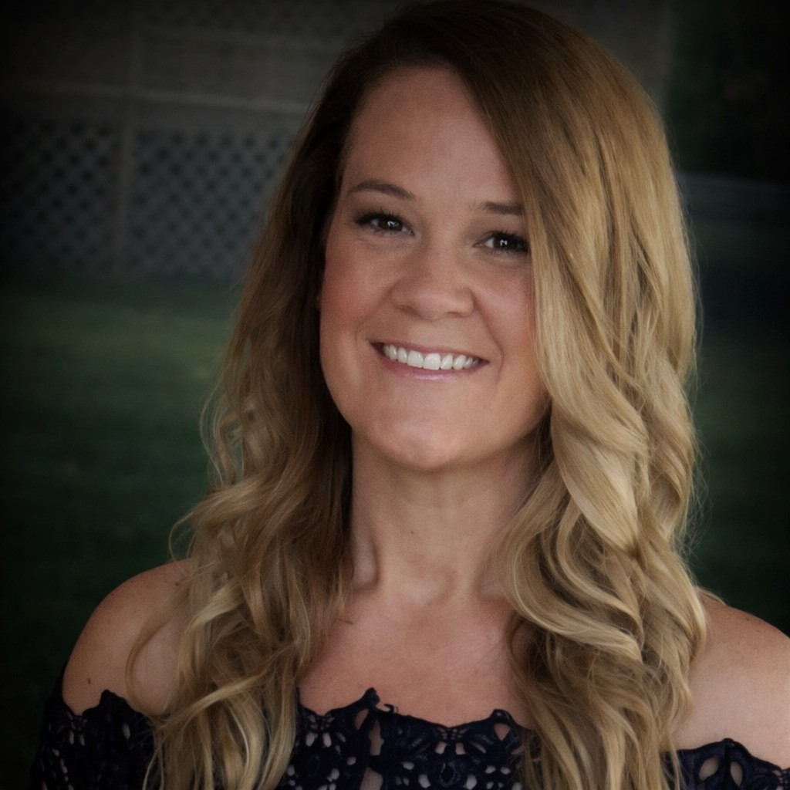

  <em>
    Change Management | Business Readiness | Agile Delivery 
    Helping business and technology teams navigate change through stakeholder alignment, process clarity, and adoption support
  </em>

  

---

## About Me
I am a Business Systems Analyst with a strong focus on change management, business readiness, and stakeholder alignment in complex healthcare and technology environments. My work centers on helping business and technical teams navigate change by translating system enhancements, process updates, and integration impacts into clear, actionable guidance.

I am especially energized by work that brings structure to ambiguity through facilitating stakeholder understanding, developing process maps and workflows, supporting UAT, and helping teams prepare for adoption. I enjoy bridging business needs and technical delivery so that changes are not only implemented, but understood and sustained.

---

## Portfolio
[View Portfolio](portfolio)

---

## Contact
[LinkedIn](https://linkedin.com/in/april-a-bruce)  
[Email](mailto:april.bruce55@gmail.com)
