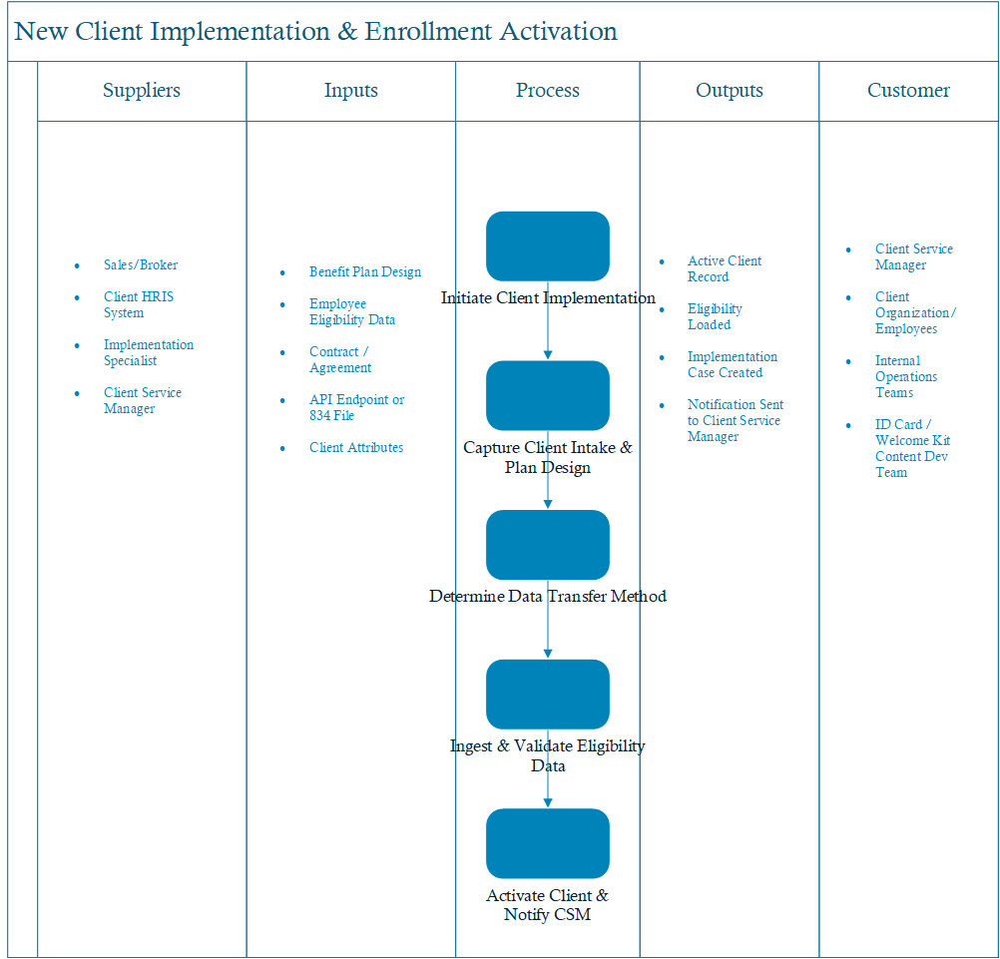

[← Back to Home](index.md)

# Portfolio

Welcome to my portfolio. Below are representative samples of my work in process engineering, business systems analysis, and delivery optimization.

---

## Workflow & UML Diagrams
Sanitized samples demonstrating use case, activity, and sequence modeling to align business and technical teams.

### Process Scoping & Stakeholder Alignment (SIPOC)
This SIPOC diagram outlines the end-to-end flow for a new client implementation and enrollment activation. It identifies upstream suppliers, required inputs, core process steps, expected outputs, and impacted customers. Artifacts like this are used to align cross-functional teams, reduce ambiguity, and establish shared understanding before detailed solution design or delivery planning begins.

Click any image to view full size.

### Future-State Client Implementation Process Map
Future-state cross-functional business process map illustrating client implementation workflow, data transfer decision logic, and swim-lane ownership from sales agreement through system activation.

### Use Case Diagram
Vendor-neutral client implementation use case diagram demonstrating conditional data integration paths (API, file, and manual upload) and downstream operational notification flows.

## Customer Personas
Examples of user persona development to support requirement clarity and user-centered design decisions in process.

---

## Journey Mapping
Process and experience mapping artifacts used to identify pain points, dependencies, and improvement opportunities in process.

---

## Dashboards & KPI Insights
Power BI dashboards designed to deliver KPI-driven insights into IT Help Desk operations, including ticket volume, priority distribution, resolution time, root-cause trends, and customer satisfaction. These visuals enable rapid drill-down analysis to identify bottlenecks, performance gaps, and opportunities for continuous process improvement.

### Power BI Dashboard – IT Help Desk Ticket Analysis

