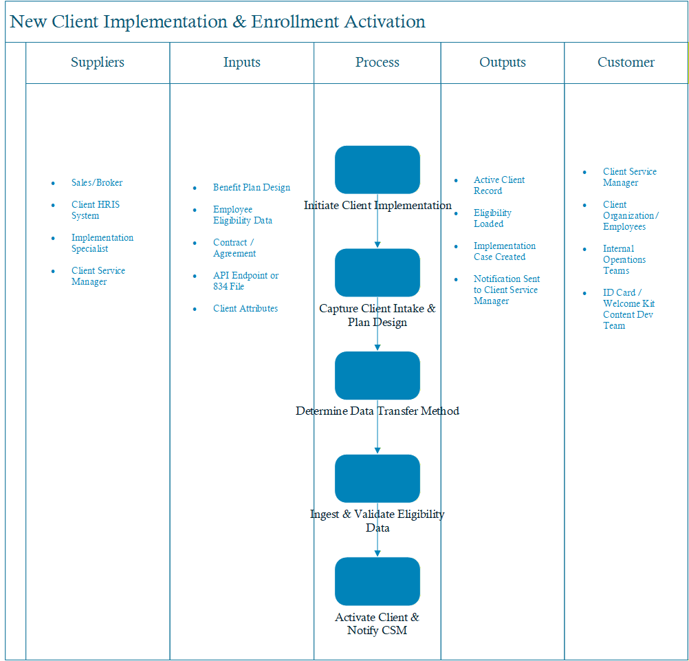

[← Back to Home](index.md)

# Portfolio

Welcome to my portfolio. Below are representative examples of my work in change management, business analysis, and delivery optimization.

---

## Change Management & Business Readiness

Artifacts focused on preparing teams for change, aligning stakeholders, and supporting successful adoption of system and process updates.

### Change Impact Summary – Data Integration & File Intake Updates

### Stakeholder Persona – Client Implementation Specialist

---

## Business Analysis & System Translation

Artifacts used to align business and technical teams, define requirements, and support solution design.

### Stakeholder Alignment & Process Scoping (SIPOC)

This SIPOC diagram illustrates the end-to-end flow for client implementation and enrollment activation, identifying key inputs, outputs, and stakeholders. It supports cross-functional alignment and reduces ambiguity prior to solution design.

### Future-State Client Implementation Process Map

Future-state cross-functional process map illustrating workflow, decision points, and ownership from sales agreement through system activation.

### Use Case Diagram

Use case diagram demonstrating conditional data integration paths (API, file, and manual input) and downstream operational notification flows.

---

## Insights & Continuous Improvement

Artifacts used to analyze performance trends, identify operational gaps, and support data-driven decision-making.

### KPI Dashboard – Operational Insights

### Operational Insights – IT Help Desk Ticket Analysis

